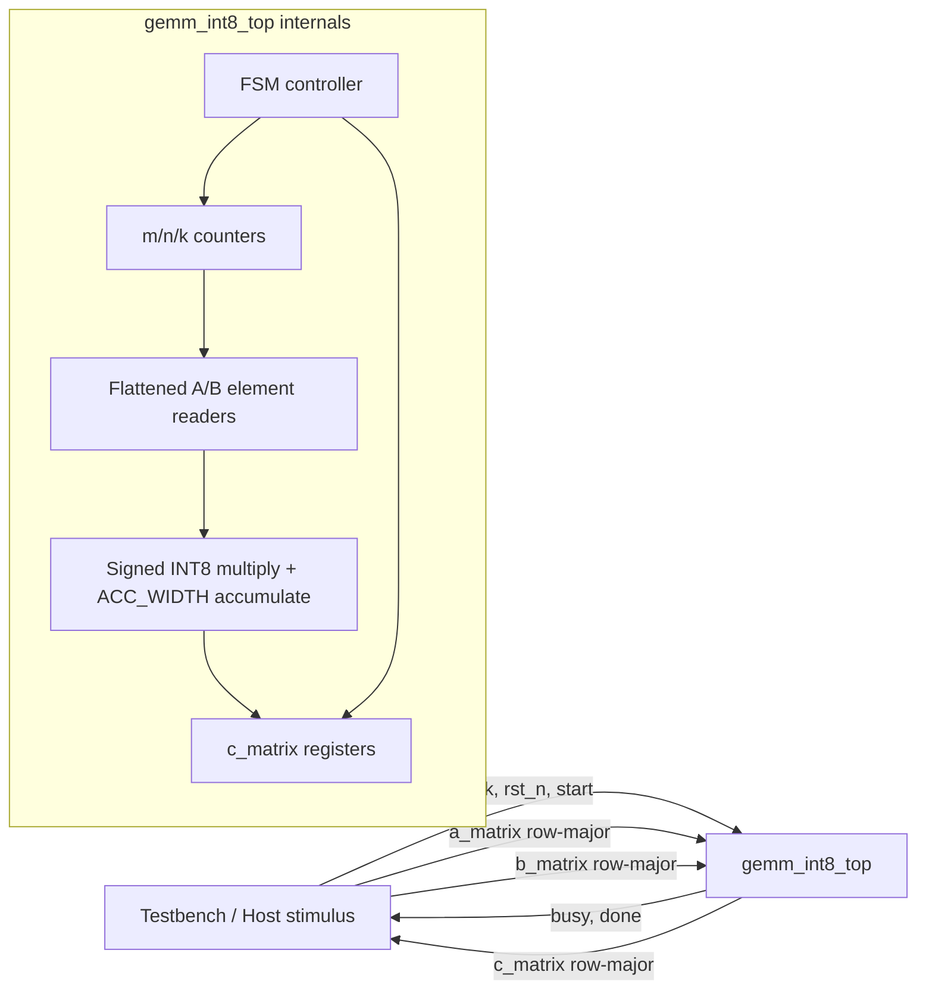
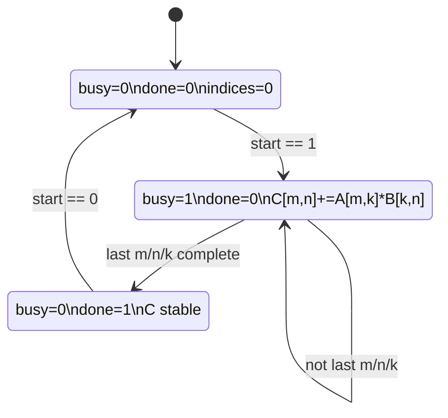
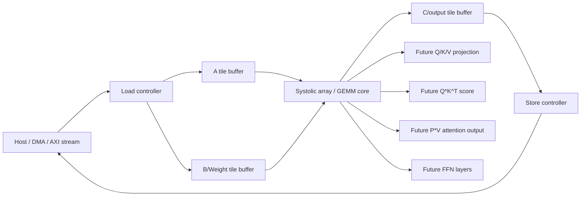

# Sơ đồ Mermaid

Ngày cập nhật: 2026-06-11.

## Sơ đồ block tổng thể hiện tại



## Sơ đồ luồng dữ liệu

```mermaid
flowchart TD
    A[A matrix packed row-major] --> ASEL[Select A[m,k]]
    B[B matrix packed row-major] --> BSEL[Select B[k,n]]
    IDX[m_idx_q, n_idx_q, k_idx_q] --> ASEL
    IDX --> BSEL
    ASEL --> MUL[Signed multiply]
    BSEL --> MUL
    MUL --> ADD[Accumulate into C[m,n]]
    COLD[Previous C[m,n]] --> ADD
    ADD --> CNEW[Updated c_matrix]
    CNEW --> DONE[done=1 when all m,n,k complete]
```

## Sơ đồ FSM hiện tại



## Sơ đồ roadmap systolic/Transformer tương lai


