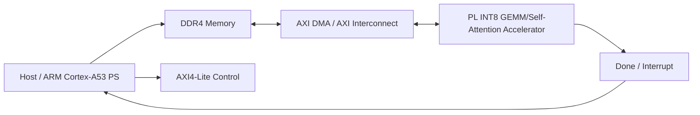
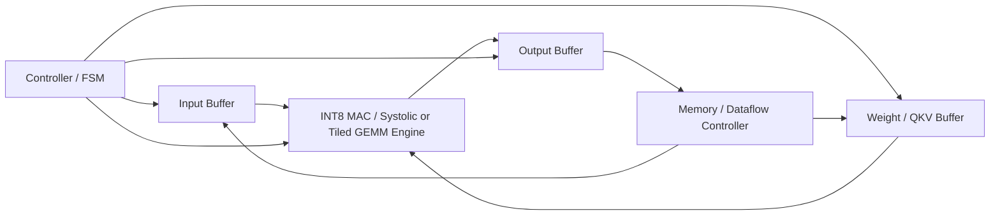
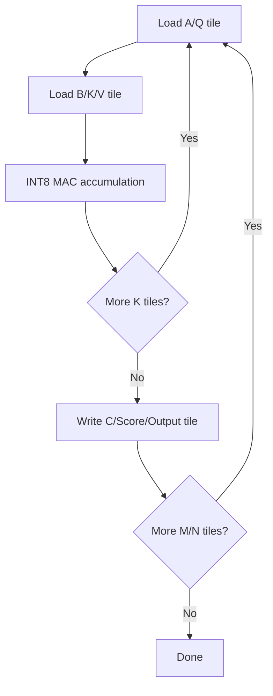
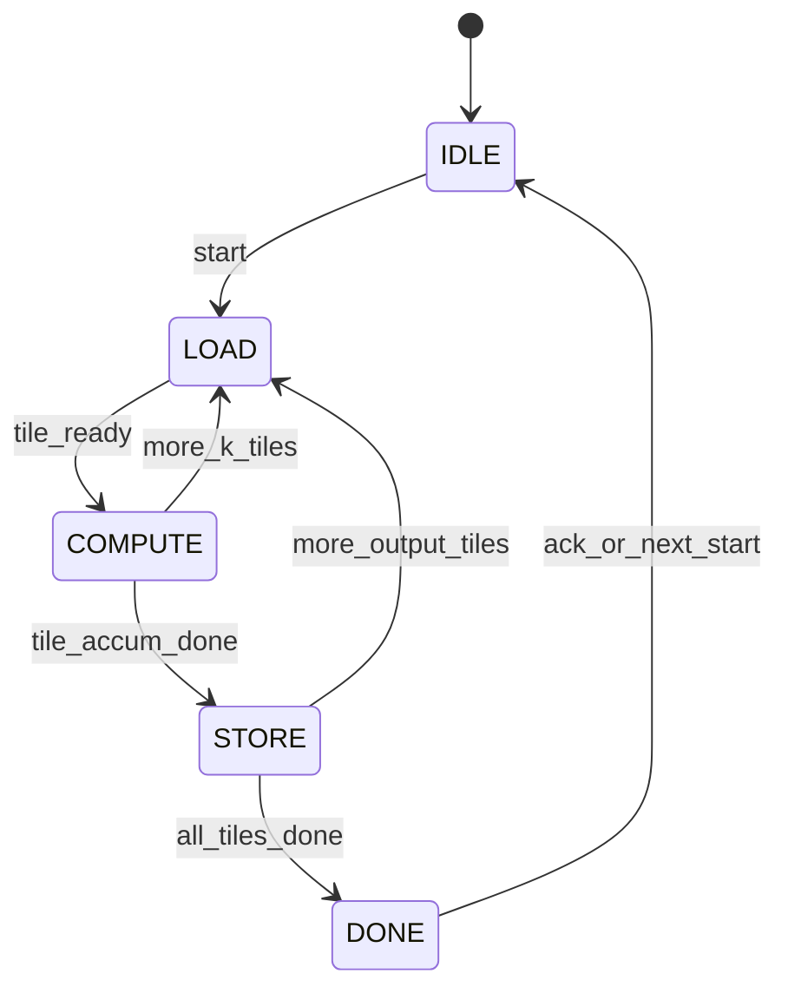
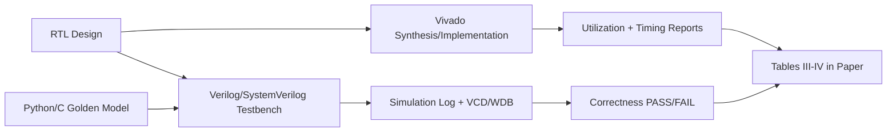

# Design and Implementation of an FPGA-Based INT8 Self-Attention/GEMM Accelerator on Xilinx Kria KV260

Draft outline cho bài báo conference. Bản này dùng tiếng Việt để nhóm dễ thảo luận nội bộ; khi có số liệu thật có thể dịch sang tiếng Anh và rút gọn theo template IEEE/ACM.

Quy ước quan trọng:

- Không ghi kết quả synthesis, timing, resource, latency, throughput hoặc board measurement nếu chưa chạy tool.
- Mọi chỗ chưa có số liệu thật giữ nguyên dạng `[TODO: điền số liệu thật]`.
- Các số liệu của related work chỉ nên dùng khi đã đối chiếu trực tiếp với paper gốc, cấu hình board, precision và workload.

## Title

**Design and Implementation of an FPGA-Based INT8 Self-Attention/GEMM Accelerator on Xilinx Kria KV260**

Tên tiếng Việt gợi ý: **Thiết kế và triển khai bộ tăng tốc INT8 cho Self-Attention/GEMM trên FPGA Xilinx Kria KV260**.

## Abstract

**Mục tiêu của section:** Tóm tắt bài toán, khoảng trống, kiến trúc đề xuất, phương pháp đánh giá và kết quả chính trong 150-250 từ.

**Draft nội dung:**

Transformer và các biến thể của self-attention phụ thuộc nhiều vào phép nhân ma trận trong các lớp Q/K/V projection, attention score và feed-forward network. Khi triển khai ở biên, các phép toán này bị giới hạn bởi tài nguyên tính toán, băng thông DDR và dung lượng buffer on-chip. Bài báo này trình bày một khung thiết kế bộ tăng tốc INT8 cho tiled GEMM/self-attention trên nền tảng AMD/Xilinx Kria KV260 hoặc K26 SOM. Kiến trúc đề xuất gồm input buffer, weight/QKV buffer, MAC/systolic hoặc tiled matrix multiplication engine, output buffer và controller/FSM để điều phối luồng dữ liệu. Giai đoạn hiện tại tập trung vào tính đúng, khả năng mô phỏng và khả năng mở rộng: ma trận nhỏ 8x8 hoặc các tile GEMM cố định được kiểm thử bằng Verilog/Vivado simulation trước khi tích hợp AXI/DMA trên board thật. Kết quả thực nghiệm sẽ báo cáo correctness, cycle count, latency, throughput, resource utilization và timing closure từ Vivado khi có thiết kế hoàn chỉnh. Các kết quả hiện tại chưa bao gồm đo board thật; các số liệu còn thiếu được đánh dấu rõ để tránh suy diễn.

[TODO: viết lại abstract bằng tiếng Anh sau khi có kết quả simulation/synthesis thật.]

**Số liệu cần điền:**

- Kích thước workload: `[TODO: M, N, K, tile size, sequence length, head dimension]`.
- Clock target và clock đạt được: `[TODO: MHz từ timing report]`.
- Latency/cycle count: `[TODO: cycles từ simulation hoặc hardware counter]`.
- Throughput: `[TODO: GOPS/TOPS hoặc matrix/s, có công thức rõ]`.
- Resource utilization: `[TODO: LUT, FF, BRAM, URAM, DSP]`.
- Correctness: `[TODO: số test PASS/FAIL, sai số nếu dùng fixed-point scaling]`.

## Keywords

FPGA accelerator; Kria KV260; K26 SOM; INT8; Transformer; self-attention; GEMM; tiled matrix multiplication; systolic array; on-chip buffering; Verilog; Vivado simulation.

## Our Contributions

1. Thiết kế một accelerator INT8 cho tiled GEMM/self-attention phù hợp với tài nguyên hạn chế trên Kria KV260/K26 SOM, ưu tiên tính đúng và khả năng kiểm thử trước khi tối ưu cực hạn.
2. Đề xuất dataflow dùng tiling và buffer reuse để giảm số lần truy cập DDR khi xử lý Q/K/V projection, attention score hoặc các GEMM nhỏ.
3. Xây dựng framework testbench/simulation để đánh giá correctness, latency theo cycle và throughput suy ra từ cycle count.
4. Chuẩn bị lộ trình mở rộng lên board KV260 thật với AXI4-Lite/AXI4-Stream, DMA, Vitis/Vivado integration và Vitis AI như future work, không claim kết quả board nếu chưa đo.

## I. Introduction

**Mục tiêu của section:** Giới thiệu vấn đề tăng tốc Transformer/self-attention ở edge FPGA, lý do chọn INT8 và KV260, và phạm vi đóng góp của bài.

**Các ý chính cần viết:**

- Transformer của Vaswani et al. đưa attention thành primitive trung tâm cho NLP/CV và nhiều mô hình hiện đại \cite{vaswani2017attention}.
- Self-attention và FFN chủ yếu tiêu tốn phép nhân ma trận; với inference nhỏ, GEMM INT8 là điểm khởi đầu hợp lý.
- FPGA phù hợp cho pipeline tùy biến, data reuse và điều khiển memory/dataflow, nhưng bị giới hạn bởi DSP/BRAM/URAM/DDR bandwidth.
- Kria KV260 là platform edge có ARM PS và programmable logic; phù hợp cho prototype accelerator kết hợp CPU/FPGA.
- Bài này không đặt mục tiêu chứng minh board-level SOTA ngay; mục tiêu là một thiết kế đúng, mô phỏng được, có đường mở rộng lên board.

**Gợi ý hình/bảng:**

- Fig. 1: Overall KV260-based system architecture.
- Một đoạn equation ngắn cho self-attention và GEMM.

**Công thức nên dùng:**

Self-attention cơ bản:

```text
Attention(Q, K, V) = softmax(QK^T / sqrt(d_k))V
```

Trong prototype INT8, các GEMM chính có thể tách thành:

```text
Q = XW_Q, K = XW_K, V = XW_V
S = QK^T
O = PV, trong đó P = softmax(S / sqrt(d_k))
```

Với GEMM:

```text
C[i,j] = sum_{k=0}^{K-1} A[i,k] * B[k,j]
```

Nếu `A` và `B` là INT8 signed, tích từng phần cần ít nhất 16 bit, accumulator thường cần rộng hơn, ví dụ 32 bit cho tile nhỏ. `[TODO: xác nhận ACC_WIDTH theo RTL thật]`.

**Số liệu cần đo hoặc trích từ tool report:**

- Baseline CPU hoặc software reference latency: `[TODO]`.
- Accelerator simulation latency theo cycle: `[TODO]`.
- Frequency target và achieved timing: `[TODO]`.
- Phạm vi workload: `[TODO: 8x8, 16x16, tiled M/N/K]`.

## II. Background and Related Work

**Mục tiêu của section:** Đặt thiết kế vào bối cảnh Transformer, FlashAttention, FPGA accelerator và KV260-related implementations.

**Các ý chính cần viết:**

- Transformer/self-attention: nguồn gốc mô hình và các phép toán chính \cite{vaswani2017attention}.
- FlashAttention: bài học về IO-awareness và tiling, dù nhắm GPU/HBM thay vì FPGA/KV260 \cite{dao2022flashattention}.
- KV260/HLS tiled GEMM accelerator gần nhất: công trình arXiv:2503.16731 tập trung matrix multiplication cho Transformer trên KV260, có persistent on-chip storage, two-level tiling và compute engine kiểu systolic-like \cite{li2025kv260transformer}. Khi so sánh cần ghi rõ khác biệt workload, precision, toolflow và mức hoàn thiện.
- ProTEA nhấn mạnh accelerator programmable cho dense Transformer encoder và tiling trên FPGA data center \cite{kabir2024protea}.
- ADAPTOR nhấn mạnh runtime-adaptive dense matrix computations cho Transformer trên nhiều FPGA \cite{kabir2024adaptor}.
- On-Device Qwen2.5 phù hợp để thảo luận hệ thống CPU-FPGA heterogeneous trên KV260, nhưng chỉ nên dùng nếu bài mở rộng sang LLM inference hoặc hybrid execution \cite{xiang2025qwen25}.
- Vitis AI UG1354 là tài liệu nền cho flow triển khai AI inference trong hệ sinh thái AMD, nhưng bài hiện tại có thể chỉ dùng như future work thay vì phụ thuộc DPU \cite{amd2023ug1354}.

**Gợi ý hình/bảng:**

- Table V: Comparison with related works.
- Một sơ đồ nhỏ phân loại: algorithm-level IO tiling, FPGA architecture, KV260 deployment, runtime-adaptive accelerator.

**Số liệu cần đo hoặc trích từ tool report/source:**

- Số liệu của related work: chỉ lấy từ paper gốc và ghi rõ board/workload/precision.
- Số liệu của project: `[TODO: không điền cho tới khi có Vivado simulation/synthesis/report]`.

### Related Work Table Draft

| Work | Target model/operator | Platform | Precision | Main optimization | Reported performance | Limitation | Relevance to our work |
|---|---|---|---|---|---|---|---|
| Vaswani et al., 2017 \cite{vaswani2017attention} | Transformer, self-attention | GPU training in original paper | Floating-point training setup | Multi-head attention, removal of recurrence/convolution | BLEU/training results in original paper; not an FPGA accelerator | Not hardware-oriented; no FPGA dataflow | Defines target operator and attention equations |
| Dao et al., 2022 \cite{dao2022flashattention} | Exact attention | GPU memory hierarchy | Floating-point/mixed precision depending implementation | IO-aware tiling to reduce HBM/SRAM transfers | Paper reports speedups for GPU workloads; use exact numbers only after checking target benchmark | GPU-centric; not directly mapped to KV260 | Motivates tile-based attention and memory reuse |
| Li and Chen, 2025 \cite{li2025kv260transformer} | Tiled matrix multiplication for Transformer Q/K/V projection | Xilinx KV260 | [TODO: verify precision from paper] | Persistent on-chip operand storage, two-level tiling, systolic-like unrolled compute | Paper abstract reports up to 7x vs ARM CPU PyTorch and up to 3.1 GFLOPs at 100 MHz; verify exact workload before quoting | HLS-oriented; reported workload may differ from our INT8 Verilog baseline | Closest KV260 reference for tiled Transformer GEMM |
| ProTEA, 2024 \cite{kabir2024protea} | Dense Transformer encoder MHA/FFN | Xilinx Alveo U55C | [TODO: verify from paper] | Runtime programmability, matrix tiling, parallel attention heads | Paper reports comparison against GPU/custom accelerators; exact values need source-table verification | Data-center FPGA; larger resource budget than KV260 | Guides programmable/tiled architecture choices |
| ADAPTOR, 2024/2025 \cite{kabir2024adaptor} | Dense Transformer encoder/decoder matrix computations | Alveo U55C, VC707, ZCU102 according to arXiv abstract | Fully quantized according to abstract; bit-width needs verification | Runtime-adaptive PE/memory utilization and tiling | Paper reports power-efficiency/speedup; exact configs need verification | More complex runtime adaptability than current milestone | Future direction for parameterized runtime control |
| On-Device Qwen2.5, 2025 \cite{xiang2025qwen25} | Qwen2.5-0.5B LLM inference | Xilinx Kria KV260 | AWQ/compressed model; hardware precision needs verification | Model compression, CPU-FPGA hybrid execution | Paper abstract reports 55.08% compression and 5.1 tokens/s vs 2.8 baseline; verify setup before comparison | LLM-level stack, not just RTL GEMM; may use different toolflow | Useful for future CPU-FPGA system integration discussion |
| AMD UG1089 \cite{amd2025ug1089} | KV260 starter kit platform | KV260/K26 SOM | N/A | Platform, interfaces, boot/software/tool integration | No accelerator result | Documentation, not research work | Provides official platform context |
| AMD UG1354 \cite{amd2023ug1354} | Vitis AI Library | AMD/Xilinx AI deployment platforms | DPU/software dependent | AI inference libraries and examples | No custom RTL result for our design | Toolflow reference, not baseline | Future work for Vitis AI comparison or integration |

## III. KV260 Platform Overview

**Mục tiêu của section:** Mô tả nền tảng phần cứng đủ để người đọc hiểu ràng buộc thiết kế.

**Các ý chính cần viết:**

- KV260 Vision AI Starter Kit gồm non-production K26 SOM, carrier card và thermal solution theo UG1089 \cite{amd2025ug1089}.
- K26 SOM dùng AMD Zynq UltraScale+ MPSoC với PS ARM và programmable logic.
- PS có quad-core Cortex-A53, dual-core Cortex-R5F, DDR controller và các peripheral; PL có LUT/FF/BRAM/URAM/DSP.
- Với accelerator INT8, DSP slices và BRAM/URAM là tài nguyên then chốt. DDR bandwidth quyết định hiệu quả nếu không có tile reuse.
- Bài cần ghi rõ dùng KV260 starter kit hay K26 SOM production, board revision, Vivado/Vitis version, clock constraint và memory path.

**Gợi ý hình/bảng:**

- Table I: KV260/K26 platform specification.
- Fig. 1: CPU/DDR/AXI/DMA/accelerator/top-level system.

### Table I. KV260/K26 Platform Specification Draft

| Item | Specification | Source / note |
|---|---:|---|
| SOM/SoC | AMD Kria K26 SOM with Zynq UltraScale+ MPSoC | UG1089/DS987 |
| Application processor | Quad-core Arm Cortex-A53, FMAX 1333 MHz | DS987, Processing System |
| Real-time processor | Dual-core Arm Cortex-R5F, FMAX 533 MHz | DS987, Processing System |
| CLB LUTs | 117,120 | DS987, Programmable Logic |
| CLB flip-flops | 234,240 | DS987, Programmable Logic |
| System logic cells | 256,200 | DS987, Programmable Logic |
| BRAM | 144 blocks of 36 Kb, 5.1 Mb total | DS987, Programmable Logic |
| URAM | 64 blocks of 288 Kb | DS987, Programmable Logic |
| DSP slices | 1,248 | DS987, Programmable Logic |
| On-SOM DDR | 4 GB 64-bit DDR4 non-ECC | [TODO: verify exact board/SOM variant and cite final source] |
| Tool version | Vivado/Vitis `[TODO]` | Tool report |
| Target clock | `[TODO: MHz]` | XDC/timing report |

**Số liệu cần đo hoặc trích từ tool report:**

- Vivado part/board file: `[TODO]`.
- Clock source và target clock: `[TODO]`.
- AXI/DMA clock domain nếu có: `[TODO]`.
- Board memory bandwidth đo thật hoặc lý thuyết có nguồn: `[TODO]`.

## IV. Proposed Accelerator Architecture

**Mục tiêu của section:** Trình bày kiến trúc accelerator ở mức module/block, interface và FSM.

**Các ý chính cần viết:**

- Top-level dự kiến: `attention_gemm_accel_top` hoặc `gemm_int8_top`. `[TODO: cập nhật đúng tên module RTL khi có code]`.
- Các block:
  - Input buffer: lưu tile `X`, `Q`, hoặc `A`.
  - Weight/QKV buffer: lưu tile `W_Q/W_K/W_V` hoặc `B`.
  - MAC/systolic/tiled GEMM engine: tính `C = A x B` với input INT8 và accumulator rộng hơn.
  - Output buffer: lưu `C`, attention score hoặc output tile.
  - Controller/FSM: điều khiển load, compute, store, valid/done.
  - Memory/dataflow controller: sau này kết nối AXI/DMA và host software.
- Giai đoạn đầu nên kiểm thử GEMM trước attention đầy đủ vì GEMM là kernel chung cho Q/K/V, `QK^T` và `PV`.
- Nếu có softmax, nên tách softmax thành module riêng ở milestone sau để không làm GEMM khó debug.

**Gợi ý hình/bảng:**

- Fig. 2: Proposed accelerator block diagram.
- Fig. 4: FSM/control flow.
- Table II: Accelerator parameters.

### Table II. Accelerator Parameters Draft

| Parameter | Meaning | Initial value | Notes |
|---|---|---:|---|
| `DATA_WIDTH` | Input activation/weight width | 8 | Signed INT8 |
| `ACC_WIDTH` | Accumulator/output width | 32 | `[TODO: verify from RTL]` |
| `M_TILE` | Tile rows of A/C | 8 | Start small for simulation |
| `N_TILE` | Tile columns of B/C | 8 | Start small for simulation |
| `K_TILE` | Reduction dimension per tile | 8 | May scale after correctness |
| `NUM_PE` | Number of MAC lanes/PEs | `[TODO]` | Depends on architecture |
| `BUFFER_DEPTH` | On-chip tile buffer depth | `[TODO]` | Derived from tile shape |
| `USE_SYSTOLIC` | Select systolic array vs sequential tiled engine | `[TODO]` | Optional compile-time parameter |
| `SCALE_SHIFT` | Fixed-point rescale shift after accumulation | `[TODO]` | Needed for quantized attention pipeline |

**Signal/parameter nên đưa vào bảng paper:**

- Control: `clk`, `rst_n`, `start`, `busy`, `done`, `valid_in`, `valid_out`.
- Data: `a_data`, `b_data`, `c_data`, `q_data`, `k_data`, `v_data`.
- Memory: address, write enable, read enable, tile indices, AXI stream valid/ready if present.
- Parameters: `DATA_WIDTH`, `ACC_WIDTH`, tile sizes, PE count, buffer depth.

**Số liệu cần đo hoặc trích từ tool report:**

- Critical path module: `[TODO: Vivado timing report]`.
- DSP per PE và total DSP usage: `[TODO]`.
- BRAM/URAM per buffer: `[TODO]`.
- Cycle count per tile: `[TODO]`.

## V. Dataflow and Memory Optimization

**Mục tiêu của section:** Giải thích cách tiling và buffer reuse làm giảm truy cập DDR/on-chip memory.

**Các ý chính cần viết:**

- GEMM tiled:

```text
for m0 in 0..M step M_TILE:
  for n0 in 0..N step N_TILE:
    C_tile = 0
    for k0 in 0..K step K_TILE:
      load A_tile[m0, k0]
      load B_tile[k0, n0]
      C_tile += A_tile x B_tile
    store C_tile
```

- Với self-attention, luồng cơ bản:
  - Q/K/V projection dùng cùng GEMM engine.
  - Score tile `S_tile = Q_tile x K_tile^T`.
  - Softmax cần scaling, exponent/approximation hoặc lookup; nên để future milestone nếu chưa có RTL.
  - Output tile `O_tile = P_tile x V_tile`.
- Buffer reuse:
  - Giữ một operand trên chip qua nhiều tile nếu phù hợp.
  - Double buffering/ping-pong buffer để overlap load/compute/store ở milestone sau.
  - Tránh ghi toàn bộ score matrix ra DDR nếu triển khai attention streaming/online về sau.
- Liên hệ FlashAttention ở mức nguyên lý: IO-aware tiling là bài học quan trọng, nhưng không claim dùng FlashAttention nếu chưa implement online softmax thật.

**Gợi ý hình/bảng:**

- Fig. 3: Dataflow of tiled GEMM/self-attention.
- Một bảng phân tích byte movement theo tile: `[TODO]`.

**Số liệu cần đo hoặc tính:**

- Bytes read/write mỗi tile: `[TODO: từ M_TILE/N_TILE/K_TILE/DATA_WIDTH/ACC_WIDTH]`.
- DDR transaction count từ simulation/hardware counter: `[TODO]`.
- Buffer capacity needed: `[TODO]`.
- Reuse factor của A/B/Q/K/V tile: `[TODO]`.

**Công thức gợi ý:**

Số phép MAC cho một GEMM:

```text
MACs = M x N x K
Operations ~= 2 x MACs
```

Throughput suy ra từ simulation:

```text
Throughput(GOPS) = Operations / (cycles / f_clk) / 1e9
```

Chỉ dùng công thức này khi `cycles` và `f_clk` đã đo được. `[TODO: điền cycles và f_clk thật]`.

## VI. Implementation Methodology

**Mục tiêu của section:** Mô tả cách thiết kế, mô phỏng, synthesis và chuẩn bị triển khai.

**Các ý chính cần viết:**

- Ngôn ngữ RTL: Verilog/SystemVerilog. `[TODO: điền đúng khi có code]`.
- Golden model: Python/NumPy hoặc C reference cho INT8 GEMM/self-attention nhỏ.
- Testbench:
  - Clock/reset.
  - Load input matrix/tile.
  - Chạy `start`.
  - Chờ `done`.
  - So sánh output với golden result.
  - In PASS/FAIL và dump waveform.
- Synthesis/implementation:
  - Vivado project hoặc non-project TCL.
  - XDC clock constraint.
  - Report utilization, timing, power estimate nếu có.
- Board integration future:
  - AXI4-Lite control register.
  - AXI4-Stream hoặc AXI memory-mapped data.
  - DMA giữa PS DDR và PL accelerator.
  - Host application đo latency end-to-end.

**Module nào nên đưa vào phần Methodology:**

- `tb_*`: testbench correctness và cycle counter. Repo hiện tại chưa có testbench RTL.
- Golden model script: `[TODO: thêm scripts/golden_gemm.py hoặc tương đương]`.
- TCL/script build: `[TODO: thêm scripts/run_vivado_sim.tcl hoặc Makefile]`.

**Gợi ý hình/bảng:**

- Fig. 5: Experimental flow from testbench to report.
- Bảng tool versions và command lines.

**Số liệu cần đo hoặc trích từ tool report:**

- Simulation command và status: `[TODO]`.
- Number of test vectors: `[TODO]`.
- Vivado synthesis status: `[TODO]`.
- Timing WNS/TNS: `[TODO]`.

## VII. Experimental Setup

**Mục tiêu của section:** Mô tả chính xác setup để người khác lặp lại kết quả.

**Các ý chính cần viết:**

- Hardware target:
  - KV260 Vision AI Starter Kit hoặc K26 SOM variant.
  - Board revision: `[TODO]`.
  - Power/cooling setup nếu đo board: `[TODO]`.
- Software/toolchain:
  - Vivado version: `[TODO]`.
  - Vitis/Vitis AI version nếu dùng: `[TODO]`.
  - Simulator: Vivado xsim/Icarus/Verilator: `[TODO]`.
  - OS/host machine: `[TODO]`.
- Workload:
  - GEMM 8x8 INT8.
  - Optional tiled 16x16/32x32 khi stable.
  - Optional self-attention toy case: sequence length `[TODO]`, head dim `[TODO]`.
- Baselines:
  - Software C/Python reference for correctness.
  - ARM Cortex-A53 implementation on KV260 nếu chạy board thật. `[TODO]`
  - Existing FPGA related work chỉ dùng trong Table V, không so trực tiếp nếu workload khác.

**Gợi ý hình/bảng:**

- Table II: Accelerator parameters.
- Table III: Resource utilization.
- Table IV: Latency/throughput comparison.

**Số liệu cần đo:**

- Simulation cycles per GEMM/tile: `[TODO]`.
- End-to-end latency host-to-accelerator nếu có DMA: `[TODO]`.
- Resource utilization: `[TODO]`.
- Power estimate hoặc board power: `[TODO: chỉ ghi nếu có tool/measurement]`.

## VIII. Results and Analysis

**Mục tiêu của section:** Báo cáo kết quả thực nghiệm một cách trung thực và phân tích nguyên nhân.

**Các ý chính cần viết khi có số liệu:**

- Correctness:
  - So sánh từng phần tử output với golden model.
  - Với INT8/fixed-point attention, ghi rõ scaling, rounding, saturation.
- Latency:
  - Cycle count cho load, compute, store.
  - Phân rã latency theo FSM state nếu có.
- Throughput:
  - Dùng công thức operations/cycle và clock.
  - Ghi rõ tính MAC là 1 op hay multiply+add là 2 ops.
- Resource:
  - LUT/FF/DSP/BRAM/URAM.
  - Nhận xét block nào chiếm nhiều tài nguyên.
- Timing:
  - WNS/TNS, achieved frequency.
  - Critical path: accumulator, adder tree, PE interconnect, buffer address logic.
- Comparison:
  - So với software reference của nhóm.
  - So với related work chỉ khi workload/precision/platform đủ tương đồng.

### Table III. Resource Utilization Template

| Resource | Used | Available | Utilization | Main contributor |
|---|---:|---:|---:|---|
| LUT | `[TODO]` | 117,120 | `[TODO]` | `[TODO]` |
| FF | `[TODO]` | 234,240 | `[TODO]` | `[TODO]` |
| DSP | `[TODO]` | 1,248 | `[TODO]` | `[TODO]` |
| BRAM36 | `[TODO]` | 144 | `[TODO]` | `[TODO]` |
| URAM | `[TODO]` | 64 | `[TODO]` | `[TODO]` |
| WNS/TNS | `[TODO]` | N/A | N/A | `[TODO]` |

### Table IV. Latency/Throughput Comparison Template

| Design/configuration | Workload | Precision | Frequency | Latency | Cycles | Throughput | Notes |
|---|---|---|---:|---:|---:|---:|---|
| Software golden model | `[TODO]` | INT8/INT32 accum | N/A | `[TODO]` | N/A | `[TODO]` | Host reference |
| ARM Cortex-A53 baseline | `[TODO]` | `[TODO]` | `[TODO]` | `[TODO]` | `[TODO]` | `[TODO]` | Only if measured on KV260 |
| Proposed RTL simulation | `[TODO]` | INT8/ACC_WIDTH `[TODO]` | `[TODO]` | `[TODO]` | `[TODO]` | `[TODO]` | Simulation-derived |
| Proposed board run | `[TODO]` | `[TODO]` | `[TODO]` | `[TODO]` | `[TODO]` | `[TODO]` | Future work until measured |

**Số liệu cần đo hoặc trích từ tool report:**

- `report_utilization`: `[TODO]`.
- `report_timing_summary`: `[TODO]`.
- Simulation transcript PASS/FAIL: `[TODO]`.
- Waveform/cycle counter screenshot hoặc log: `[TODO]`.

## IX. Discussion

**Mục tiêu của section:** Giải thích trade-off, giới hạn hiện tại và lý do các quyết định thiết kế hợp lý.

**Các ý chính cần viết:**

- INT8 giúp giảm bandwidth và tăng mật độ MAC, nhưng cần xử lý scaling/saturation cẩn thận.
- Accumulator width cần đủ rộng; nếu quá nhỏ dễ overflow khi K lớn.
- Systolic array có thể tăng throughput nhưng làm debug, routing và timing khó hơn; tiled sequential engine có thể là milestone tốt cho bản đầu.
- Softmax là nút khó vì exponent, normalization và dynamic range. Bài có thể giới hạn ở GEMM/QKV hoặc self-attention nhỏ trước.
- DDR access có thể lấn át compute nếu tile reuse kém; đây là lý do cần input/weight/output buffer và dataflow rõ ràng.
- So sánh với FlashAttention cần thận trọng: dùng ý tưởng IO-aware, không claim cùng thuật toán nếu chưa có online softmax.
- Kết quả simulation không thay thế kết quả board; board run cần AXI/DMA, cache coherency, host overhead và đo thời gian thật.

**Gợi ý hình/bảng:**

- Một bảng “current limitation vs planned fix”.
- Optional chart: latency breakdown theo state/load/compute/store. `[TODO]`.

**Số liệu cần đo:**

- Overflow/saturation events trong testbench: `[TODO]`.
- Compute utilization: `[TODO]`.
- DDR/AXI bandwidth achieved nếu chạy board: `[TODO]`.

## X. Conclusion and Future Work

**Mục tiêu của section:** Kết luận đóng góp thực tế và nêu lộ trình tiếp theo.

**Các ý chính cần viết:**

- Bài đề xuất khung accelerator INT8 cho GEMM/self-attention trên KV260, tập trung vào dataflow rõ, buffer reuse và kiểm chứng bằng simulation.
- Kết quả đầu tiên nên là correctness/cycle count cho GEMM tile nhỏ.
- Khi có synthesis, báo cáo resource/timing để đánh giá khả năng fit trên K26.
- Future work:
  - Tách PE/systolic array parameterized.
  - Thêm AXI4-Lite + AXI DMA.
  - Thêm softmax fixed-point hoặc approximate softmax có kiểm chứng sai số.
  - Chạy board KV260 thật và đo end-to-end latency/throughput/power.
  - Khảo sát Vitis HLS/Vitis AI/DPU nếu chuyển sang system-level inference.
  - Mở rộng từ GEMM sang full self-attention hoặc Transformer encoder block nhỏ.

**Gợi ý hình/bảng:**

- Không cần hình mới; có thể nhắc lại Fig. 5 flow và Table IV kết quả.

**Số liệu cần điền:**

- Summary results: `[TODO: chỉ điền sau khi đã có Result section]`.

## Required Figures and Tables

### Fig. 1: Overall KV260-based system architecture

Nội dung: ARM Cortex-A53 PS, DDR4, AXI interconnect/DMA, PL accelerator, buffers và optional host application.

Placeholder caption: `Fig. 1. Overall system architecture of the proposed KV260-based INT8 GEMM/self-attention acceleration flow.`

### Fig. 2: Proposed accelerator block diagram

Nội dung: input buffer, weight/QKV buffer, MAC/systolic engine, output buffer, controller/FSM, memory/dataflow controller.

Placeholder caption: `Fig. 2. Proposed accelerator architecture with tiled INT8 compute engine and on-chip buffer reuse.`

### Fig. 3: Dataflow of tiled GEMM/self-attention

Nội dung: tile load, compute accumulation, store output; extension from Q/K/V projection to score and output projection.

Placeholder caption: `Fig. 3. Tiled GEMM and self-attention dataflow used to reduce external memory traffic.`

### Fig. 4: FSM/control flow

Nội dung: `IDLE -> LOAD -> COMPUTE -> STORE -> DONE`, hoặc state thật từ RTL khi có.

Placeholder caption: `Fig. 4. Controller FSM for loading tiles, executing INT8 MAC operations, and writing output tiles.`

### Fig. 5: Experimental flow from testbench to report

Nội dung: RTL -> testbench -> golden model compare -> waveform -> synthesis -> utilization/timing report -> optional board run.

Placeholder caption: `Fig. 5. Experimental methodology from RTL simulation to Vivado reports and future KV260 board validation.`

### Table I: KV260/K26 platform specification

Đặt ở Section III. Nguồn chính: UG1089 và DS987.

### Table II: Accelerator parameters

Đặt ở Section IV hoặc VII. Điền `DATA_WIDTH`, `ACC_WIDTH`, tile sizes, PE count, buffer depth.

### Table III: Resource utilization

Đặt ở Section VIII. Điền từ Vivado `report_utilization`.

### Table IV: Latency/throughput comparison

Đặt ở Section VIII. Điền từ simulation và board run nếu có.

### Table V: Comparison with related works

Đặt ở Section II hoặc VIII. Chỉ so sánh định tính nếu workload/precision/platform khác nhau.

## Suggested Mermaid Drafts

### Fig. 1 draft



### Fig. 2 draft



### Fig. 3 draft



### Fig. 4 draft



### Fig. 5 draft



## Repo/Code Mapping Notes

Repo inspected on branch `codex/fpga-auto-docs-testbench`.

Current files found:

- `README.md`
- `AGENTS.md`
- `docs/research_to_project_mapping.md`
- `research/fpga_recent_papers.md`
- `research/paper_comparison_table.md`
- `research/research_notes.md`

No Verilog/SystemVerilog/HLS source files or testbenches were found in the current repository snapshot. Therefore:

- **Module nào nên đưa vào Architecture:** Chưa có module thật để cite. Khi có RTL, ưu tiên đưa `gemm_int8_top`, `pe`, `systolic_array`, `tile_buffer`, `controller_fsm`, `axi_dma_wrapper` hoặc tên tương đương vào Section IV.
- **Module nào nên đưa vào Methodology:** Khi có code, đưa `tb_gemm_int8_top` hoặc testbench attention tile vào Section VI/VII để mô tả kiểm thử correctness và cycle count.
- **Signal/parameter nào nên đưa vào bảng:** `DATA_WIDTH`, `ACC_WIDTH`, `M_TILE`, `N_TILE`, `K_TILE`, `NUM_PE`, `BUFFER_DEPTH`, `clk`, `rst_n`, `start`, `busy`, `done`, data valid/ready, tile address/counter.
- **Testbench có thể dùng để lấy latency/cycle count:** Chưa có testbench trong repo hiện tại. Nên tạo testbench GEMM 8x8 INT8 trước, thêm `cycle_counter` bắt đầu từ `start` đến `done`, rồi ghi log `PASS cycles=<n>`.

## Next Tasks for Our Team

1. Chốt phạm vi paper: GEMM-only, Q/K/V projection, hay full toy self-attention. Đề xuất bản đầu: GEMM INT8 8x8/tiled, sau đó mở rộng attention.
2. Tạo RTL baseline `rtl/gemm_int8_top.sv` hoặc tên tương đương, có `DATA_WIDTH`, `ACC_WIDTH`, tile parameters và FSM rõ ràng.
3. Tạo testbench `tb/tb_gemm_int8_top.sv` với ma trận INT8 nhỏ, golden output, PASS/FAIL, waveform dump và cycle counter.
4. Thêm script chạy simulation: Vivado xsim TCL hoặc Icarus/Verilator nếu hỗ trợ SystemVerilog đủ dùng.
5. Tạo golden model Python/C cho GEMM và sau đó cho self-attention toy case.
6. Chạy Vivado synthesis cho target K26/KV260, lưu `report_utilization`, `report_timing_summary` và `report_power` nếu dùng power estimate.
7. Điền Table III và Table IV bằng số liệu thật từ log/report. Không chỉnh số liệu thủ công nếu không trace được nguồn.
8. Vẽ lại Fig. 1-5 bằng draw.io/PowerPoint/LaTeX/TikZ hoặc Mermaid export, bảo đảm caption nhất quán.
9. Kiểm tra related work từ PDF gốc, đặc biệt precision, platform, workload và reported performance trước khi đưa vào Table V cuối cùng.
10. Nếu hướng tới board thật, thiết kế AXI4-Lite register map, AXI DMA path, host C/Python application và phương pháp đo latency end-to-end.
11. Sau khi có kết quả, viết lại Abstract/Results/Conclusion bằng tiếng Anh conference style.
12. Chuẩn bị artifact reproducibility: commit hash, tool version, command line, seed/config Vivado, input vectors và logs.

## References

[1] A. Vaswani et al., "Attention Is All You Need," arXiv:1706.03762, 2017.

[2] T. Dao, D. Y. Fu, S. Ermon, A. Rudra, and C. Ré, "FlashAttention: Fast and Memory-Efficient Exact Attention with IO-Awareness," arXiv:2205.14135, 2022.

[3] Advanced Micro Devices, Inc., "Kria KV260 Vision AI Starter Kit User Guide (UG1089)," rev. 1.4, 2025.

[4] Advanced Micro Devices, Inc., "Vitis AI Library User Guide (UG1354)," version 3.5, 2023.

[5] Advanced Micro Devices, Inc., "Kria K26 SOM Data Sheet (DS987)," rev. 1.6, 2026.

[6] R. Li and S. Chen, "Design and Implementation of an FPGA-Based Hardware Accelerator for Transformer," arXiv:2503.16731, 2025.

[7] E. Kabir, J. D. Bakos, D. Andrews, and M. Huang, "ProTEA: Programmable Transformer Encoder Acceleration on FPGA," arXiv:2409.13975, 2024.

[8] E. Kabir, J. D. Bakos, D. Andrews, and M. Huang, "A Runtime-Adaptive Transformer Neural Network Accelerator on FPGAs," arXiv:2411.18148, 2024.

[9] M. Xiang, R. Fernando, and B. Wang, "On-Device Qwen2.5: Efficient LLM Inference with Model Compression and Hardware Acceleration," arXiv:2504.17376, 2025.

